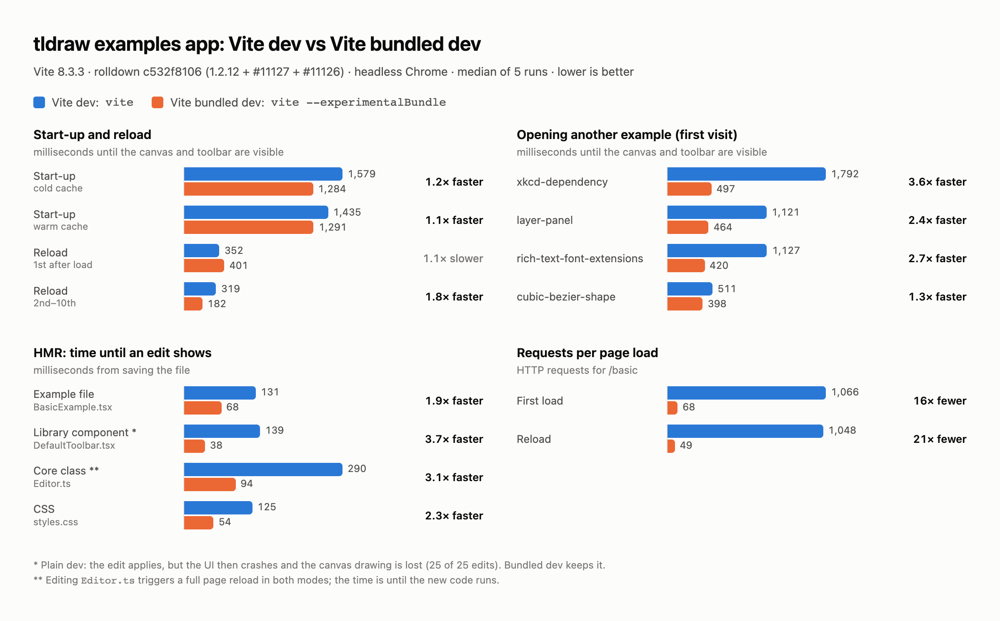

# tldraw: Vite dev vs Vite bundled dev



## Setup

| Item | Value |
|---|---|
| App | tldraw `apps/examples` at `db1c86e` (2026-10-02). It imports the tldraw packages from source (`packages/*/package.json` → `./src/index.ts`). |
| Vite | 8.3.3 |
| rolldown | `c532f8106`, local release build: `main` at `d0e720345` (1.2.12 + 31 commits) + #11127 + #11126 |
| Plain dev | `vite` |
| Bundled dev | `vite --experimentalBundle`, no config change |
| Browser | Google Chrome 154, headless, a new profile for every run |
| Machine | Apple M4 Pro, macOS 26.6.2, Node 24.12.0 |

Changes in the tldraw checkout (`pnpm-workspace.yaml`):

```yaml
minimumReleaseAgeExclude:
  - vite
  - rolldown
  - '@rolldown/*'
  - '@oxc-project/*'
overrides:
  vite: 8.3.3
  vite>rolldown: link:<rolldown worktree>/packages/rolldown
```

## Method

- 5 rounds. Each round runs both modes, and each mode runs once cold and once warm. The mode that starts goes back and forth between rounds.
- **Cold run:** delete `apps/examples/node_modules/.vite`, start the server, open `/basic`.
- **Warm run:** keep the Vite cache, start the server, then:
  1. open `/basic`
  2. reload `/basic` 10 times in the same tab
  3. open 4 other examples, each in a new tab, for the first time
  4. draw a rectangle, then edit each of 4 files 5 times (HMR)
- **Ready** = the tldraw canvas and the main toolbar are both visible.
- **HMR time** = from writing the file until the change shows: a new DOM element for the example file, a `console.log` for the `.ts`/`.tsx` library files, a computed style for the CSS file.
- Numbers are medians over the 5 runs (HMR: over 25 edits).

## Results

| Metric | Vite dev | Vite bundled dev | |
|---|---|---|---|
| Start-up to ready, cold cache | 1,579 ms | 1,284 ms | 1.2x faster |
| Start-up to ready, warm cache | 1,435 ms | 1,291 ms | 1.1x faster |
| Reload, 1st after load | 352 ms | 401 ms | 1.1x slower |
| Reload, 2nd–10th | 319 ms | 182 ms | 1.8x faster |
| First visit: `xkcd-dependency` | 1,792 ms | 497 ms | 3.6x faster |
| First visit: `layer-panel` | 1,121 ms | 464 ms | 2.4x faster |
| First visit: `rich-text-font-extensions` | 1,127 ms | 420 ms | 2.7x faster |
| First visit: `cubic-bezier-shape` | 511 ms | 398 ms | 1.3x faster |
| HMR: `BasicExample.tsx` | 131 ms | 68 ms | 1.9x faster |
| HMR: `DefaultToolbar.tsx` * | 139 ms | 38 ms | 3.7x faster |
| HMR: `Editor.ts` ** | 290 ms | 94 ms | 3.1x faster |
| HMR: `styles.css` | 125 ms | 54 ms | 2.3x faster |
| Requests, first load | 1,066 | 68 | 16x fewer |
| Requests, reload | 1,048 | 49 | 21x fewer |

\* Vite dev: the edit applies, but the UI then crashes and the canvas drawing is lost (25 of 25 edits). Bundled dev keeps it.

\*\* Editing `Editor.ts` triggers a full page reload in both modes; the time is until the new code runs.

## Files

- `perf.png`: the chart above.
- `summary.json`: medians, ranges and p90 values computed from `raw/`.
- `raw/<mode>-<cold|warm>-<round>.json`: one file per run, with every measured value and every error. In error messages, the path of the tldraw checkout is replaced with `<tldraw>`.
- `scripts/bench.mjs`: one run, on port 5440. `TLDRAW_DIR=<tldraw checkout> node scripts/bench.mjs <plain|bundled> <cold|warm> <out.json>`
- `scripts/run.sh`: all 20 runs. `TLDRAW_DIR=<tldraw checkout> scripts/run.sh <outDir>`
- `scripts/summarize.cjs`: prints the summary. `node scripts/summarize.cjs raw > summary.json`
- `scripts/chart.html` + `scripts/render.mjs`: the chart. `TLDRAW_DIR=<tldraw checkout> node scripts/render.mjs scripts/chart.html perf.png`. Playwright is loaded from the tldraw checkout. The numbers in `chart.html` are typed in from `summary.json`.
